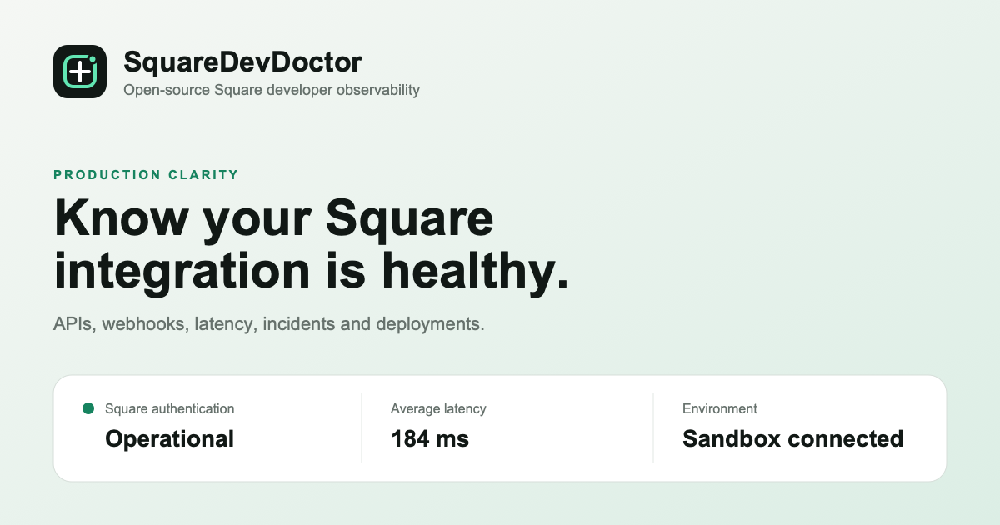

# SquareDevDoctor

SquareDevDoctor is an open-source monitoring console for Square developer environments. Connect a Square Sandbox or Production environment to inspect API authentication, catalog access, request latency, optional Vercel deployment context, and redacted webhook activity from one focused interface.

## Features

- Square Sandbox and Production support
- Live Locations and Catalog API health probes
- Response status and latency diagnostics
- Optional read-only Vercel deployment context
- Verified Square HMAC-SHA256 webhook ingestion
- Redaction of common sensitive payload fields
- Responsive developer console
- Complete Open Graph, Twitter, structured-data, sitemap and robots metadata
- Stateless encrypted credential sessions

## Security model

Connection credentials are encrypted server-side with AES-256-GCM and returned only as a secure, HTTP-only, same-site cookie. They are never stored in a database, browser storage, analytics, application logs, or page HTML. Sessions expire after eight hours.

This hosted release intentionally uses temporary sessions rather than persistent user accounts. Start with Square Sandbox and use restricted credentials wherever possible.

## Local development

```bash
npm install
cp .env.example .env.local
# Add a random SESSION_SECRET containing at least 32 characters.
# Set SITE_URL and REPOSITORY_URL for your deployment.
npm run dev
```

Open `http://localhost:3000`, select **Connect Square**, and enter a Sandbox token.

## Deploy to Vercel

1. Import the repository into Vercel.
2. Add `SESSION_SECRET` to Production, Preview and Development.
3. Set `SITE_URL` to the deployment's canonical URL and `REPOSITORY_URL` to your public fork.
4. Use separate random secret values for production and development.
5. Deploy.

No Square access token belongs in Vercel environment variables. Each developer supplies credentials through the encrypted connection screen.

## Optional Vercel connection

The connection form accepts an optional read-only Vercel token, project ID and team ID. These values share the same temporary encrypted session and are used only to retrieve the latest production deployment.

## Webhooks

Self-hosted installations can send generic events to:

```text
POST /api/webhooks/{source}
X-SquareDevDoctor-Secret: your-WEBHOOK_INGEST_SECRET
```

For Square, configure `SQUARE_WEBHOOK_SIGNATURE_KEY` and the exact `SQUARE_WEBHOOK_NOTIFICATION_URL`. Payloads are verified before sensitive fields are redacted.

## Contributing

Contributions are welcome. See [CONTRIBUTING.md](CONTRIBUTING.md) and [SECURITY.md](SECURITY.md).

Licensed under the [Apache License 2.0](LICENSE).
